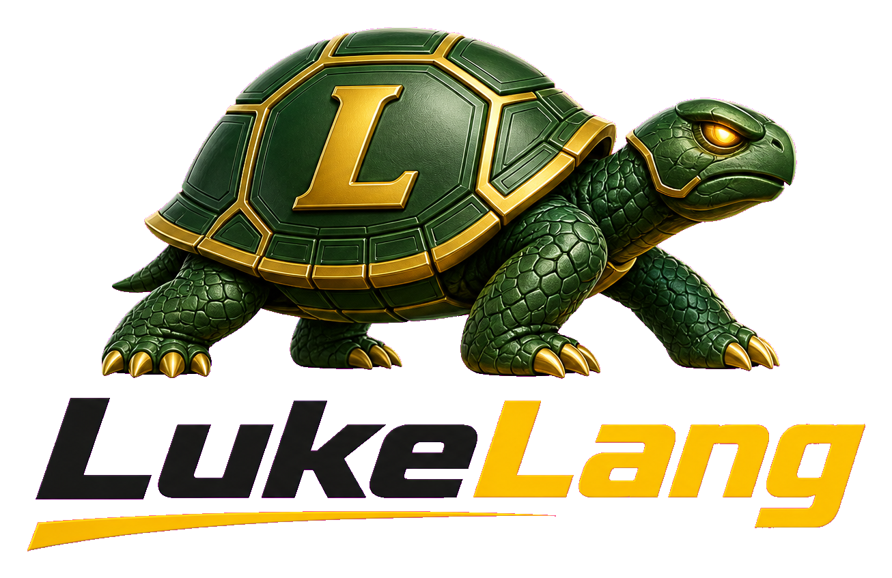

<div align="center">



**A reactive-native, full-stack language with a technical syntax.**

Write clearly. Ship like systems.  
Change finds its own way — from database row to screen pixel.

[Strategy](docs/STRATEGY.md) ·
[Live Graph](docs/LIVE_GRAPH.md) ·
[Backend Publish](docs/BACKEND_PUBLISH.md) ·
[Build Mode](docs/BUILD_MODE.md) ·
[Editor Tooling](docs/EDITOR_TOOLING.md) ·
[Reactive](docs/REACTIVE.md) ·
[Getting Started](docs/getting_started.md) ·
[AGENTS](AGENTS.md) ·
[Documentations](documentations/README.md)

</div>

---

## The idea

Mainstream stacks glue **three worlds** together with fetch, cache invalidation, subscriptions, and diffing.

**LukeLang is one graph.**

```
DB row  →  server cell  →  [wire]  →  client cell  →  pixel
   └────────────── one dependency graph, compiler-known ──────────────┘
```

You never fetch. Never invalidate. Never subscribe. Never diff.  
You declare dependencies once — and change travels on its own.

That graph is the **Live Graph**: the reactive substrate of the whole stack.

---

## Taste the language

```luke
print("Hello from Luke Build")

let name = "Luke"
print("My name is " + name)

signal price = 100
signal quantity = 3
derived total = price * quantity
print("total=" + total)
```

Technical on the surface. Precise underneath: typed Build mode, arena memory, no GC on the ship path.
See [`docs/SYNTAX_V2_SPEC.md`](docs/SYNTAX_V2_SPEC.md).
---

## Live Graph — war cry surface

```luke
# server
watch user from db where "id = 1"
push watch user on req

# client
signal user = ""
bind("name", user)
watch user from "http://127.0.0.1:8798/watch"
```

External `UPDATE` → one SSE push → one reactive write → **exactly one region paints**.

See [`docs/LIVE_GRAPH.md`](docs/LIVE_GRAPH.md).

---

## Quick start

```bash
git clone https://github.com/lucasdmarshall/LukeLang.git
cd LukeLang/vm && make

./build/luke BUILD ../examples/build/hello.lk -o hello && ./hello
./build/luke BUILD ../examples/build/hello_browser.lk -target browser -o web/hello
./build/luke SHOW  ../examples/build/hello.lk
```

| Mode | Command | What you get |
| --- | --- | --- |
| **Build** | `luke BUILD file.lk` | Native / WASM / browser — **no GC**, arena memory |
| **Show** | `luke SHOW file.lk` | Build when possible; Play VM fallback |
| **Play VM** | `luke SHOW file.luke --vm` | Bytecode VM + GC (compatibility layer; conversational `.luke`) |
| **Migrate** | `luke MIGRATE file.luke -o out.lk` | Conversational → syntax v2 |

Need WASI / browser targets? Install [WASI SDK](https://github.com/WebAssembly/wasi-sdk) under `.tools/wasi-sdk` (or set `LUKE_WASI_SDK`).

---

## What ships today

| Layer | State |
| --- | --- |
| Build → native C | Core, functions, blueprints, `IMPORT`, typechecks |
| Build → WASM | `-target wasm` (WASI) · `-target browser` (html/js glue) |
| Reactive engine | Cells, derived, `WHEN`, `BIND`, lists/maps, batch flush |
| Live Graph | `WATCH` / `PUSH WATCH`, SSE ordering, IVM cache, time-travel prototype |
| Stdlib | files, json, http, server, sqlite, args, env, paths, process, js |
| Packages | `IMPORT luke/<name>` · `luke PKG init\|install\|publish\|lock` |
| Frontend | Argus reactive patcher · Hanka → DOM/CSS flex |
| Tests | `luke TEST` · GitHub Actions CI |

Examples live in `examples/build/`. Play-only demos in `examples/native/` (use `--vm`).

---

## Design principles

1. **Be different where the user stands** — conversational syntax and reactive model, not exotic plumbing.
2. **Build is the language of record** — layouts, types, arenas. Play VM is the skateboard.
3. **The browser is the renderer** — Path A: compile to DOM + CSS; Argus patches surgically.
4. **One beachhead** — win reactive full-stack web first. Mobile, game, and canvas tracks are parked until earned.

Full decision record: [`docs/STRATEGY.md`](docs/STRATEGY.md).

---

## Docs map

Hub: [`documentations/`](documentations/README.md) · papers: [`documentations/papers/`](documentations/papers/README.md) · full set: [`docs/`](docs/README.md)

| Doc | For |
| --- | --- |
| [`STRATEGY.md`](docs/STRATEGY.md) | Identity, wedge, plan |
| [`LIVE_GRAPH.md`](docs/LIVE_GRAPH.md) | DB row → pixel thesis |
| [`BUILD_MODE.md`](docs/BUILD_MODE.md) | Types, memory, packages, browser packaging |
| [`REACTIVE.md`](docs/REACTIVE.md) | Client reactive engine |
| [`getting_started.md`](docs/getting_started.md) | First program |
| [`FRONTEND_ROADMAP.md`](docs/FRONTEND_ROADMAP.md) | Argus / Hanka path |
| [`AUTH.md`](docs/AUTH.md) | Auth as language / secure by compiler |
| [`BACKEND_ROADMAP.md`](docs/BACKEND_ROADMAP.md) | HTTP framework / routes / migrations |
| [`DEPLOY.md`](docs/DEPLOY.md) | TLS via reverse proxy, C10K knobs |
| [`LEGACY.md`](docs/LEGACY.md) | Removed JS emitters |

---

## Contributors

LukeLang is built in the open. See [`CONTRIBUTORS.md`](CONTRIBUTORS.md) for people we want to thank by name.

---

## The wall sentence

> **Win reactive full-stack first. Keep the syntax. Let the browser render. Prove it with one app. Earn the rest later.**
>
> **Live Graph:** never fetch, never invalidate, never subscribe, never diff — declare dependencies once, and change finds its own way from row to pixel.
